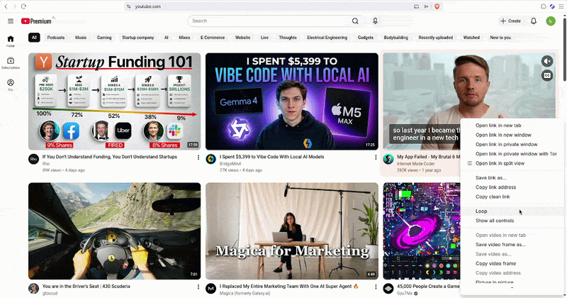

# YouTube Distiller

**Right-click any YouTube video → a dense, fluff-free brief in the side panel — distilled on your own Claude subscription, no API key.**

<p align="center">
  
</p>

Transcript via `yt-dlp`, distillation via the Claude Agent SDK in subscription mode. The browser spawns a local host on demand and it exits when the brief is done — no server, no daemon, nothing left running.

- **Your subscription, not an API key** — the Agent SDK runs on your Pro/Max plan. No per-token bill, no key to manage.
- **Distillation, not a summary** — compress the delivery, never the knowledge. Every fact, number, name, and step survives; the sponsor read and "smash subscribe" don't.
- **Right-click anything** — feed, search, sidebar, or the watch page; you never open the video. A context menu, not a fragile on-page button, so a YouTube redesign can't break it.
- **Nothing idle** — the native host is spawned per request and shuts down when the brief lands.

## How it works

```
  Right-click any YouTube video
        │   context menu — the id comes from the link URL, so there's
        ▼   no content script and no YouTube DOM for a redesign to break
  Side panel
        │   connectNative — the browser spawns the host on demand,
        ▼   then it exits once the brief is done (nothing idle)
  Native host
        │
        ▼
  yt-dlp -J  ──▶  transcript
        │
        ▼
  Claude Agent SDK  ──▶  distillation — on your Claude subscription, no API key
        │
        ▼
  Side panel  ◀──  NDJSON deltas, rendered as markdown as they stream in
```

## Install

Node ≥ 20, `yt-dlp` on PATH, Claude Code logged in (Pro/Max).

```bash
./install.sh
```

Load `extension/` unpacked at `brave://extensions` (Developer mode on). Works in any Chromium browser.

## Use

- **Distill** — right-click a video → **✦ Distill this video** (or the toolbar icon, or paste a URL in the **⋯** menu).
- **Mark watched** — after a brief: opens the video in a background tab, plays it muted at 2×, likes it, closes the tab — a real watch-signal that nudges your recommendations.
- **Gemini fallback** — auto when a video has no captions, or **⟳ video** for visual content. Needs `cp .env.example .env` + a free `GEMINI_API_KEY`.

## Why

YouTube buries real knowledge in delivery — restated intros, sponsor reads, "let me know in the comments." A summary throws away detail to get short. A distillation throws away only the scaffolding and keeps every load-bearing fact — the synthesis of `/distill`, `/explain`, and `/tight-prose` behind the brief. You read the 20% that was the point, on a plan you already pay for.

MIT
